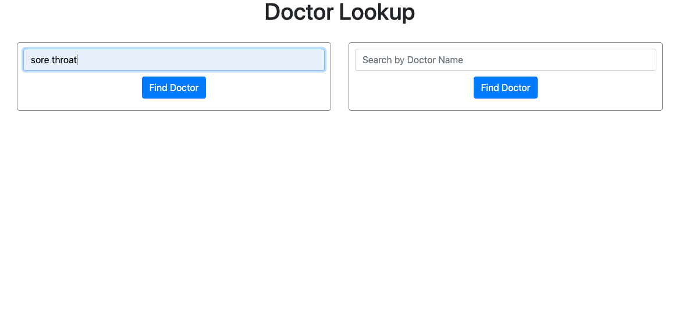
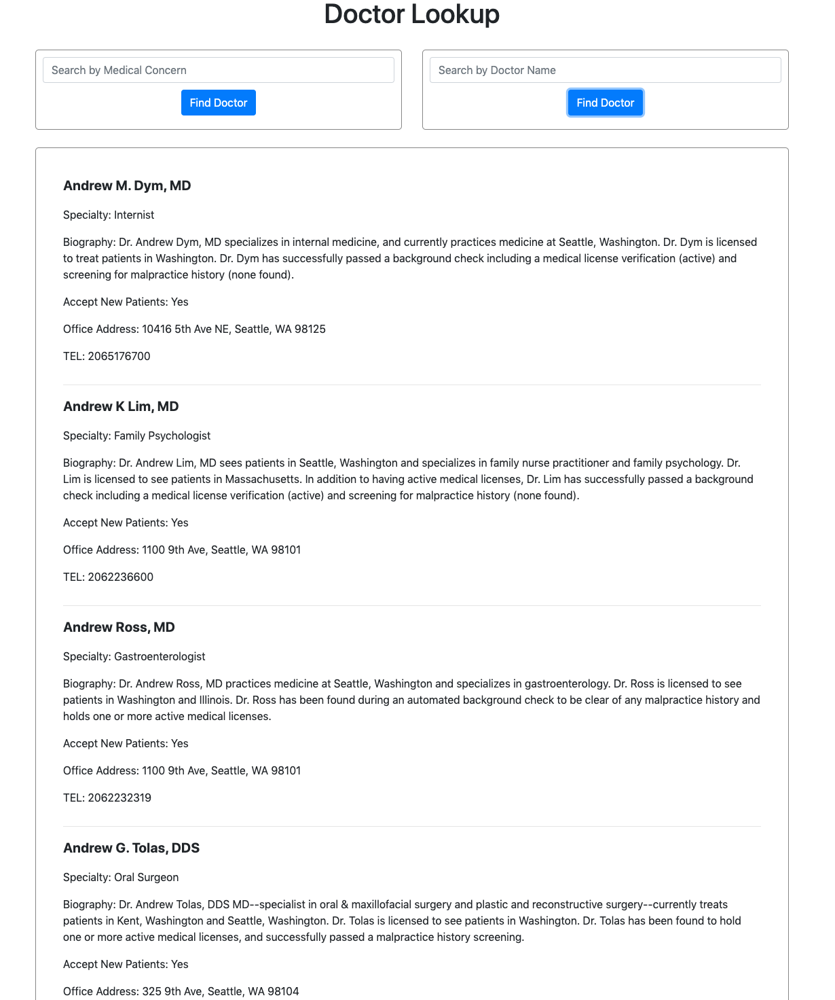

# Doctor Lookup

#### _Intermediate JavaScript - week 3 solo project: Doctor Lookup, 9/13/2019_

## Description
Build a Doctor Lookup Application with API call

Create a website for a Doctor Lookup that users may enter a medical issue (ie: “sore throat”, "rash", etc.) into a form, submit it, and receive a list of doctors in state of WA who can treat their medical issue.

To provide the data, I used one of the leading providers of medical API data - [the BetterDoctor API](https://developer.betterdoctor.com/). This is a live API by a Series A funded startup currently under active development, and used by industry heavy-hitters such as HealthNet to provide accurate medical data.


## Application should have:

- A user should be able to enter a medical issue to receive a list of doctors in WA that fit the search query.

- A user should also be able to to enter a name to receive a list of doctors in WA that fit the search query.

- If the query response includes any doctors, the following information should be included about each doctor: first name, last name, address, phone number, website (if they have) and whether or not the doctor is accepting new patients (the API provides this data).

- If the API call results in an error (not 200 state), the application should return a notification that states what the error is.

- If the query response doesn't include any doctors (for instance, if no doctors meet the search criteria), the application should return a notification that states that no doctors meet the criteria. (This is not an error so it should be handled separately from any errors.)


Search by medical concern: 
You'll get a list of doctor in WA: 

## Authorization
The API requests require the use of a generated API key. You can generate a new API key.
- Visit the BetterDoctor API site and click “Get a free API key”.

- Fill out the form.

- Your API key should be listed on the front page (ex: “a2c356ibgh44…..”) or under My Account > Applications.


To authenticate an API request, you should provide your API key in the `Authorization` header.


| Parameter | Type | Description |
| :--- | :--- | :--- |
| `api_key` | `string` | **Required**. Your API key |


### Specs

- Spec 1: Enter a medical issue and it returns a list of doctors.
  - Input: "Sore Throat"
  - Output: list of Doctors

- Spec 2: Enter Doctor name and it returns a list of doctors.
  - Input: "Andrew"
  - Output: list of Doctors

- Spec 3: Enter response doesn't include any doctors and it returns a message.
  - Input: "Hello"
  - Output: : "Sorry, your search returned no results."

- Spec 4: Submit an empty form, you'll get a message.
  - Input: blank
  - Output: : "Please enter something to see a doctor list."


## Setup/Installation Requirements

1. Clone this repo:
```
$git clone https://github.com/misakimichy/doctor-lookup.git
```

2. Install dependencies: 
```
$npm install
```

3. Sign up or Log in to [betterdoctor.com](https://developer.betterdoctor.com/) and get an API key.

4. Create `.env` file in your root directory with command ` $touch .env ` and insert this line with your API key:
```
$ apiKey = YOUR API KEY
```

5. Open the web site with this command:
```
$npm run start
```

## Known Bugs
* No known bugs at this time.

## Support and contact details
 misaki.koonce@gmail.com

## Technologies Used
_Git, GitHub, HTML, CSS, Bootstrap, jQuery, JavaScript, Webpack, Jasmine and Karma


## License
Copyright © 2019 under the MIT License